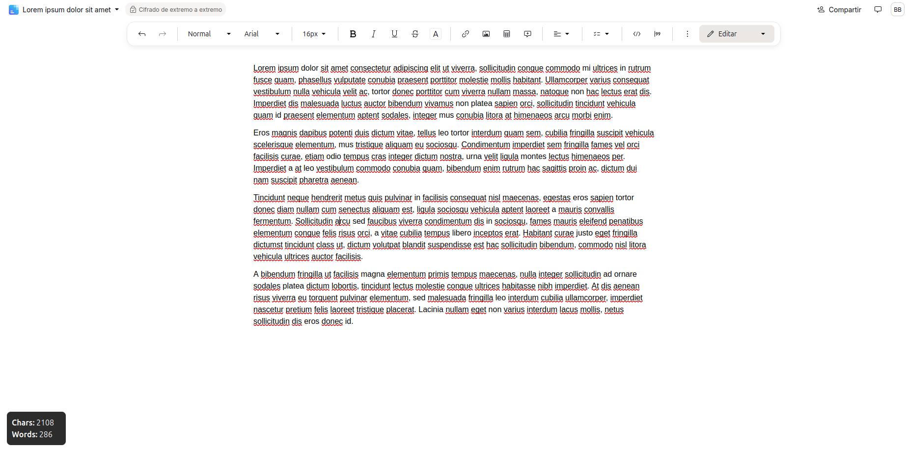
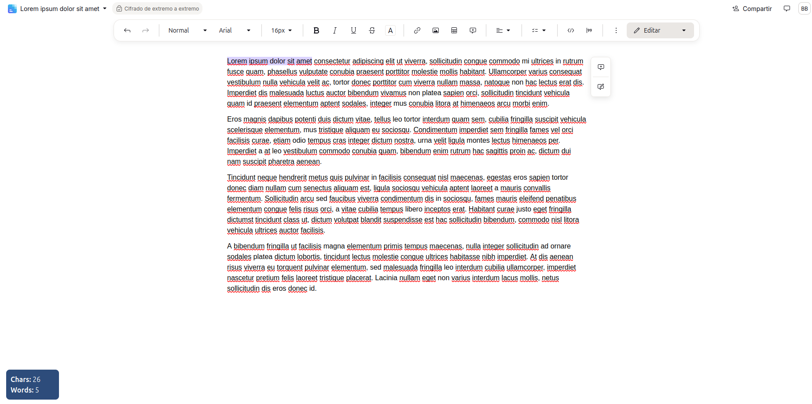

# ProtonCount - Word & Character Counter for Proton Docs

**ProtonCount** is a lightweight browser extension designed for **Proton Docs**. It provides a floating widget inside the document editor that tracks and displays the current character and word counts in real-time.

## 🚀 Features

* **Real-time Statistics:** Automatically calculates the number of characters and words in your document.
* **Floating Widget:** Adds a non-intrusive, floating dashboard to the bottom-left corner of the screen.
* **Dynamic Counting Modes:**
    * By **default**, it shows the count for the **entire document** (background color: dark grey/anthracite, `#2c2c2c`).
    * When you **select** text, it instantly switches to display the count for **only the selection** (background color: blue, `#2D4C7B`).
* **Auto-Refresh:** Updates the count every `REFRESH_INTERVAL` (configurable in `content.js`) to ensure the data is current.

---

## 🔒 Privacy & Data

**ProtonCount is 100% focused on privacy.**

* **Local Processing:** All counting and calculations happen **locally** within your browser.
* **No Data Collection:** The extension does **not** store, save, or transmit any of your document content or counting data to any external server or third party. The counts are displayed on screen solely for the user's convenience.

---

## 📂 Project Structure

| File | Purpose |
| :--- | :--- |
| `manifest.json` | The **configuration file** that defines the extension's metadata, permissions, and targets the Proton Docs URL (`docs-editor.proton.me`). |
| `widget.js` | Responsible for the **User Interface (UI)**. It creates and styles the floating `div` element (`floating-widget`) and injects it into the page. |
| `content.js` | Contains the **counting logic**. It extracts text from `DocumentEditor` elements, calculates the word and character counts, and updates the widget every `REFRESH_INTERVAL`. |

---

## 🎨 Screenshoots

| Proton count total | Proton count selection |
|---------------|------------------|
|  |  |

---

## 🛠️ Installation (Load Unpacked Extension)

Since this is a custom extension, you need to install it manually using your browser's "Developer Mode."

1.  **Prepare the Files:**
    Ensure you have `manifest.json`, `widget.js`, and `content.js` (and the icon `protoncount-48.png`, in a `icons` subfolder) placed together in a folder named `ProtonCount`.

2.  **Enable Developer Mode:**
    Navigate to your browser's extension management page:
    * **Chrome/Edge:** Go to `chrome://extensions`.
    * **Firefox:** Go to `about:debugging#/runtime/this-firefox`.
    * Toggle the **"Developer mode"** switch to **ON**.

3.  **Load the Extension:**
    * Click the **"Load unpacked"** or **"Load Temporary Add-on"** button.
    * Select the `ProtonCount` folder containing your files.

4.  **Usage:**
    Open any document in [Proton Docs](https://docs.proton.me/). The word and character counts will appear in the bottom-left corner of the editor.